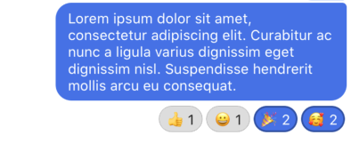

This component is a chat view for your Matrix client.


## Props

keyboardOffset: number,
showReactions?: boolean,
enableComposer?: boolean,
isEditing?: Boolean,
isReplying?: Boolean,
onEndEdit?: Function,
enableReplies?: Boolean,
onCancelReply?: Function,
selectedMessage?: Message,
onPress?: Function | null,
onLongPress?: Function | null,
onSwipe?: Function | null,
renderTypingIndicator?: Function | null,
flatListProps?: FlatListProps,

### `room`

`Room Object` (required)

This is the room you want to display messages from.

```js
import {MessageList} from 'rn-matrix';
...
<MessageList room={currentRoom} />
```

### `showReactions`

`boolean` (optional, default **false**)

If enabled, reactions will be shown on Message bubbles.



```js
import {MessageList} from 'rn-matrix';
...
<MessageList room={currentRoom} showReactions />
```

### `onPress`

`onPress(Message)` (optional, default **null**)

This is called when a message is pressed. It passes the pressed Message to it.

```js
import {MessageList} from 'rn-matrix';
...
const handleMessagePress = message => {
  console.log(message)
}
...
<MessageList onPress={handleMessagePress} />
```

### `onLongPress`

`onLongPress(Message)` (optional, default **null**)

This is called when a message is **long pressed**. It passes the pressed Message to it.

```js
import {MessageList} from 'rn-matrix';
...
const handleLongMessagePress = message => {
  console.log(message)
}
...
<MessageList onLongPress={handleLongMessagePress} />
```

### `onSwipe`

`onSwipe(Message)` (optional, default **null**)

This is called when a message is **swiped**. It passes the pressed Message to it.

If not given, swipe will not be enabled.

Typically, swipes are used for replies, but they can be used for other purposes as well.

```js
import {MessageList} from 'rn-matrix';
...
const handleSwipe = message => {
  console.log(message)
}
...
<MessageList onSwipe={handleSwipe} />
```

### `selectedMessage`

`Message` (required for editing and replies, default **null**)

This is the message that is being edited, or is being replied to.

Examples of using the selected message can be found in the [Example App](https://gitlab.com/annie-elequin/rn-matrix/-/tree/master/RnMatrixExample).

### `renderTypingIndicator`

`renderTypingIndicator()` (optional, default **null**)

This receives a function which should return a typing indicator. This overrides the default typing indicator.

```js
import {MessageList} from 'rn-matrix';
...
const renderTypingIndicator = () => {
  return (
    <Text>Typing...</Text>
  )
}
...
<MessageList renderTypingIndicator={renderTypingIndicator} />
```

### `flatListProps`

`FlatListProps` (optional, default **null**)

View FlatList props: [https://reactnative.dev/docs/flatlist#props](https://reactnative.dev/docs/flatlist#props)

```js
import {MessageList} from 'rn-matrix';
...
const props = {
  inverted: true
}
<MessageList flatListProps={props} />
```

## Composer

### `enableComposer`

`boolean` (optional, default **false**)

If enabled, the default composer will be rendered without you needing to import it.

```js
import {MessageList} from 'rn-matrix';
...
<MessageList room={currentRoom} enableComposer />
```

### `keyboardOffset`

`number` (required IF composer enabled, default **0**)

This is required so that the composer will move correctly with the keyboard. This is notably a problem with react-navigation, because `KeyboardAvoidingView` does not account for the height of the navigation bar.

Generally, this number should be something like this:

```js
import { MessageList } from 'rn-matrix';
import { useHeaderHeight } from '@react-navigation/stack';
import { StatusBar } from 'react-native';
...
const headerHeight = useHeaderHeight()
...
<MessageList enableComposer keyboardOffset={headerHeight + StatusBar.currentHeight} />
```

## Replies

Note: selectedMessage is required to use replies.

### `enableReplies`

`enableReplies` (optional, default **false**)

Required to use built-in replies.

### `isReplying`

`boolean` (required if using replies, default **false**)

If you're in the process of replying to a message or not.

### `onCancelReply`

`onCancelReply()` (optional, default **() => {}**)

Useful for setting `isReplying` to `false`, and other handlers.
