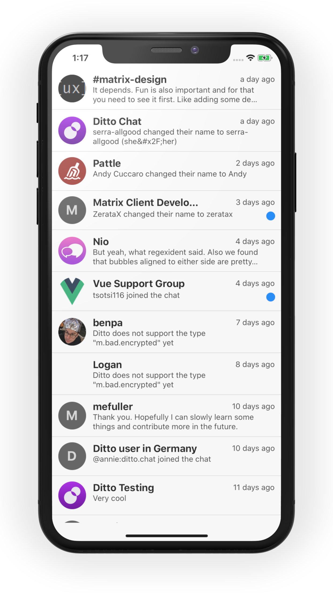

For a full example, see [https://gitlab.com/annie-elequin/rn-matrix-example](https://gitlab.com/annie-elequin/rn-matrix-example)

You just need three variables to start up the client: your **homeserver**, **access token**, and **MXID**.

`createClient` and `start` should be called at the **top level** of your app in order to start the client as soon as possible.

The `RoomList` component will automatically populate a FlatList with rooms, as seen below.

```js
import React, { useEffect } from 'react';
import { SafeAreaView } from 'react-native';
import { matrix, RoomList } from 'rn-matrix';

const baseUrl = '<your-matrix-homeserver>'; // https://matrix.ditto.chat
const accessToken = '<your-access-token>';
const mxid = '<your-mxid>'; // @annie:ditto.chat

export default function App() {
  useEffect(() => {
    matrix.createClient(baseUrl, accessToken, mxid);
    matrix.start();
  }, []);

  return (
    <SafeAreaView>
      <RoomList />
    </SafeAreaView>
  );
}
```

If all goes well, you should see a room list populated with your Matrix rooms:


